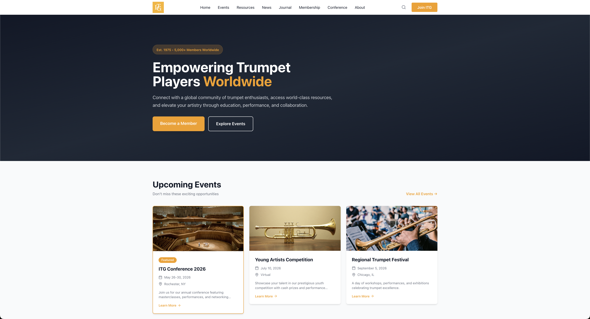
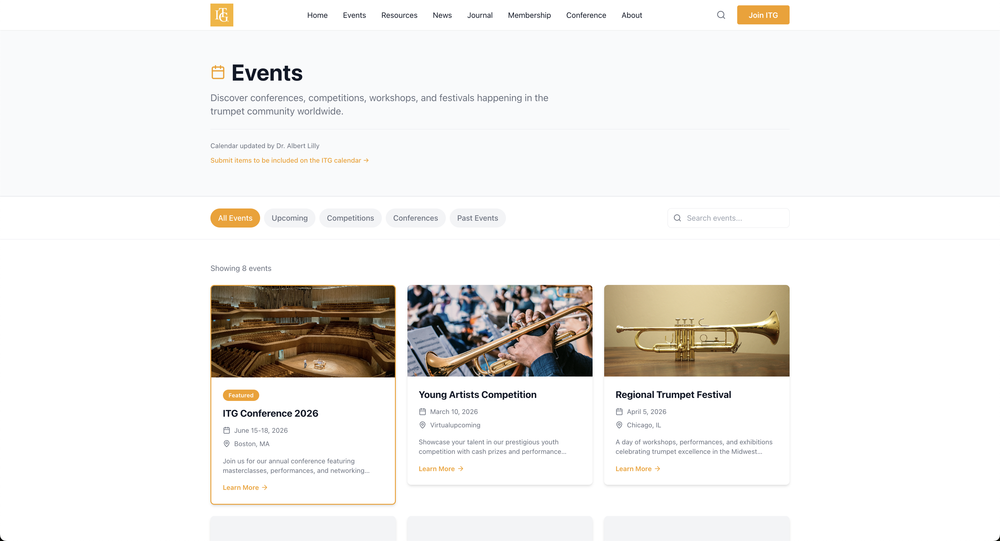
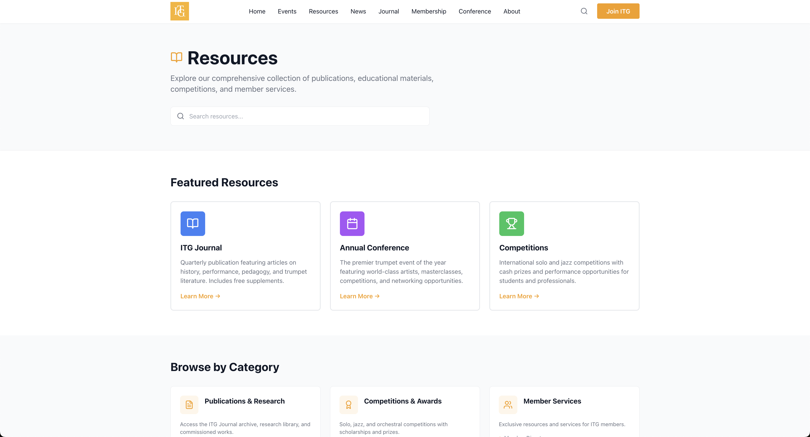
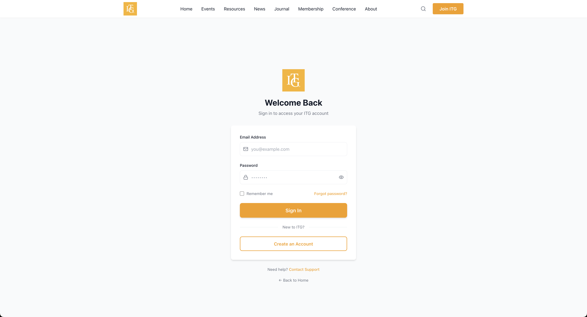

# ITG Website Redesign

A modern redesign concept for the International Trumpet Guild website, transforming the current Joomla-based site into a clean, responsive, and user-friendly experience.

**[View Live Site →](https://itg-redesign.vercel.app/)**

[GitHub Repository](https://github.com/evanfy/itg-redesign)

---

## Project Overview

This project reimagines the International Trumpet Guild's website with a focus on modern design principles, improved user experience, and mobile-first responsive design. The redesign maintains the organization's brand identity while updating the interface for 2025.

## Key Improvements

- **Simplified Navigation** - Reduced cognitive load with clear, organized menu structure
- **Modern Visual Design** - Clean typography, generous white space, and professional color palette
- **Mobile-First Approach** - Fully responsive design optimized for all devices
- **Enhanced User Experience** - Smooth animations, intuitive filtering, and clear call-to-actions
- **Information Architecture** - Organized content into scannable categories and cards

---

## Design Decisions

### Color Palette:
- Brand Orange (#f57e0b) - Primary CTAs and accents
- White/Light Gray backgrounds - Modern, clean aesthetic
- Dark text (#111827) - Readability and professionalism

### Typography & Spacing
- Single, modern font family for consistency
- Large, clear headings with proper hierarchy
- Generous padding and margins (2-3x original spacing)
- Readable body text (16-18px)

### Layout Philosophy
- Card-based design for content organization
- Grid layouts for scannable information
- Sticky navigation for easy access
- White space to let content breathe

---

## Tech Stack
- **React** - Component-based UI architecture
- **React Router** - Client-side routing and navigation
- **Tailwind CSS** - Utility-first styling for rapid development
- **AOS (Animate On Scroll)** - Smooth scroll animations
- **Lucide React** - Modern, consistent icon library
- **Vercel** - Deployment and hosting

---

## Project Structure
```
src/
├── components/
│   ├── Header.jsx      # Navigation bar
│   ├── Hero.jsx        # Hero section
│   ├── Footer.jsx      # Footer component
│   └── (more to come)
├── pages/
│   ├── Home.jsx        # Homepage
│   ├── Events.jsx      # Events listing
│   ├── Resources.jsx   # Resources page
│   └── Login.jsx       # Login page
└── App.js              # Main app with routing
```

---

## ✨ Features

### Homepage
- Compelling hero section with clear value proposition
- Featured upcoming events with imagery
- Latest news and announcements
- "Why Join ITG" benefits section
- Smooth scroll animations throughout

### Events Page
- Category filtering (Upcoming, Competitions, Conferences, Past)
- Live search by title and location
- Sticky filter bar for easy access
- Event cards with dates, locations, and descriptions
- Results count and empty state handling

### Resources Page
- Featured resources highlight section
- 6 organized category cards
- Search functionality
- ITG purpose statement
- Quick links for additional resources

### Login Page
- Clean, centered authentication form
- Show/hide password toggle
- Form validation
- Remember me functionality
- Create account option


## Development Progress

**Day 1:**
- [x] Project setup with React & Tailwind
- [x] Custom color system implementation
- [x] Header component with mobile menu
- [x] Hero section with CTAs
- [x] Basic homepage layout
- [x] Footer component

**Day 2:**
- [x] Built reusable EventCard and NewsCard components
- [x] Improved hero section with better copy and gradient
- [x] Added "Why Join ITG" benefits section
- [x] Implemented smooth scroll animations (AOS)
- [x] Updated navigation to match ITG structure (News, Journal, Resources Events, Membership, Conference)
- [x] Enhanced footer with secondary links (Give, Store, Network, Contact)
- [x] Added My Account and social media links
- [x] Polished desktop and mobile layouts

**Day 3:** Complete
- [x] Built complete Events page with filtering and search
- [x] Built Resources page with organized categories
- [x] Built Login page with form validation
- [x] Connected all navigation flows
- [x] Sticky filter bars and search functionality
- [x] Category-based resource organization
- [x] Professional authentication UI

**Day 4:** Complete
- [x] Added real ITG logo throughout site
- [x] Professional trumpet/music photography
- [x] Mobile responsiveness testing
- [x] Fixed all navigation links
- [x] Deployment to Vercel
- [x] Final documentation

---

## Screenshots

### Homepage - Desktop


### Events Page


### Resources Page


### Login Page


### Mobile View


--

## About This Project

This redesign was created as part of a portfolio project demonstrating:

- **Modern Web Design Principles** - Contemporary UI/UX patterns and best practices
- **React Component Architecture** - Reusable, maintainable component structure
- **Responsive Design** - Mobile-first approach with full device support
- **Information Architecture** - Organizing complex content for accessibility
- **User-Centered Design** - Prioritizing usability and clear navigation

---

## 💻 Running Locally
```bash
# Clone the repository
git clone https://github.com/evanfy/itg-redesign.git

# Navigate to directory
cd itg-redesign

# Install dependencies
npm install

# Start development server
npm start
```

Opens on `http://localhost:3000`

---

## Future Enhancements

If this were a production project, additional features would include:

- **Full Authentication System** - Member login with session management
- **News Page** - Complete news archive with categories and search
- **Member Dashboard** - Personalized member portal
- **Conference Registration** - Online event registration and payment
- **Journal Access** - Digital journal archive for members
- **Advanced Search** - Site-wide search functionality
- **Content Management** - Admin panel for content updates
- **Multilingual Support** - Translations for international members

---

## Notes for Reviewers

This project represents approximately **one week of work** and demonstrates:

1. **Rapid Prototyping** - Building a complete redesign concept quickly
2. **Component Thinking** - Creating reusable, maintainable components
3. **Design Systems** - Establishing consistent colors, spacing, and patterns
4. **User Experience** - Simplifying complex information architecture
5. **Modern Development** - Using current tools and best practices

The focus was on creating a compelling visual redesign and functional prototype rather than implementing full backend functionality. All navigation and interactions are functional within the scope of the frontend application.

---

- **International Trumpet Guild** - Original organization and content
- **Unsplash** - High-quality trumpet and music photography
- **Tailwind CSS** - Utility-first CSS framework
- **Lucide Icons** - Beautiful, consistent icon set

---

## License

This is a portfolio project created for educational and demonstration purposes. The International Trumpet Guild name and branding belong to their respective owners.

---

**Created by Evan Atwell** | [GitHub](https://github.com/evanfy) | December 2025