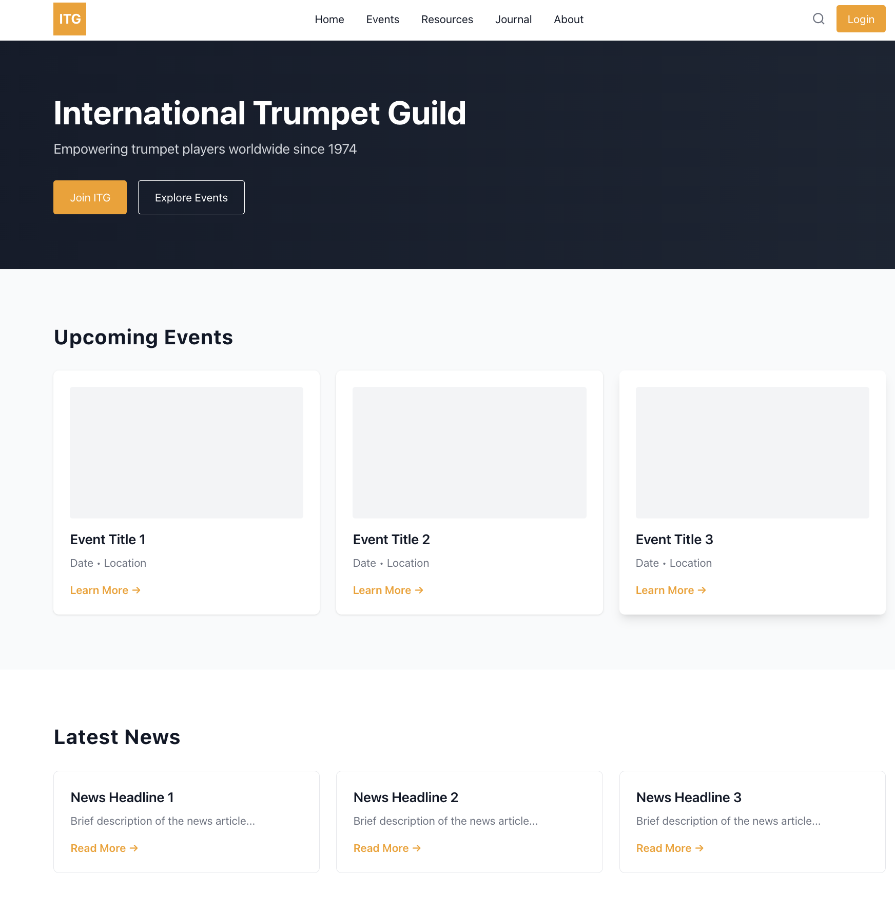

# ITG Website Redesign

A modern redesign concept for the International Trumpet Guild website, transforming the current Joomla-based site into a clean, responsive, and user-friendly experience.

## Project Goals
- Modernize the visual design with a clean, professional aesthetic
- Improve navigation and information architecture
- Create a mobile-first, fully responsive experience
- Maintain brand identity while updating for 2025

## Design Decisions

**Color Palette:**
- Brand Orange (#f57e0b) - Primary CTAs and accents
- White/Light Gray backgrounds - Modern, clean aesthetic
- Dark text (#111827) - Readability and professionalism

**Key Improvements:**
- Simplified navigation (moved secondary items to footer/menu)
- Increased white space for better readability
- Card-based layouts for content organization
- Sticky header for easy navigation
- Mobile-responsive hamburger menu

## Tech Stack
- **React** - Component-based UI
- **React Router** - Multi-page navigation
- **Tailwind CSS** - utility-first styling
- **Lucide React** - Modern icon library

## Project Structure
```
src/
├── components/
│   ├── Header.jsx      # Navigation bar
│   ├── Hero.jsx        # Hero section
│   ├── Footer.jsx      # Footer component
│   └── (more to come)
├── pages/
│   ├── Home.jsx        # Homepage
│   ├── Events.jsx      # Events listing
│   ├── Resources.jsx   # Resources page
│   └── Login.jsx       # Login page
└── App.js              # Main app with routing
```

## Current Progress
- [x] Project setup with React & Tailwind
- [x] Custom color system implementation
- [x] Header component with mobile menu
- [x] Hero section with CTAs
- [x] Basic homepage layout
- [x] Footer component
- [ ] Event cards component
- [ ] Resources page design
- [ ] Login page design
- [ ] Scroll animations
- [ ] Full mobile optimization

## Running Locally
```bash
npm install
npm start
```

Opens on `http://localhost:3000`

## Screenshots

**Homepage Hero & Layout**


## About This Project

This redesign was created as part of a portfolio project demonstrating:
- Modern web design principles
- React component architecture
- Responsive design best practices
- Understanding of organizational website needs

---

**Current Status:** Day 1 - Foundation complete